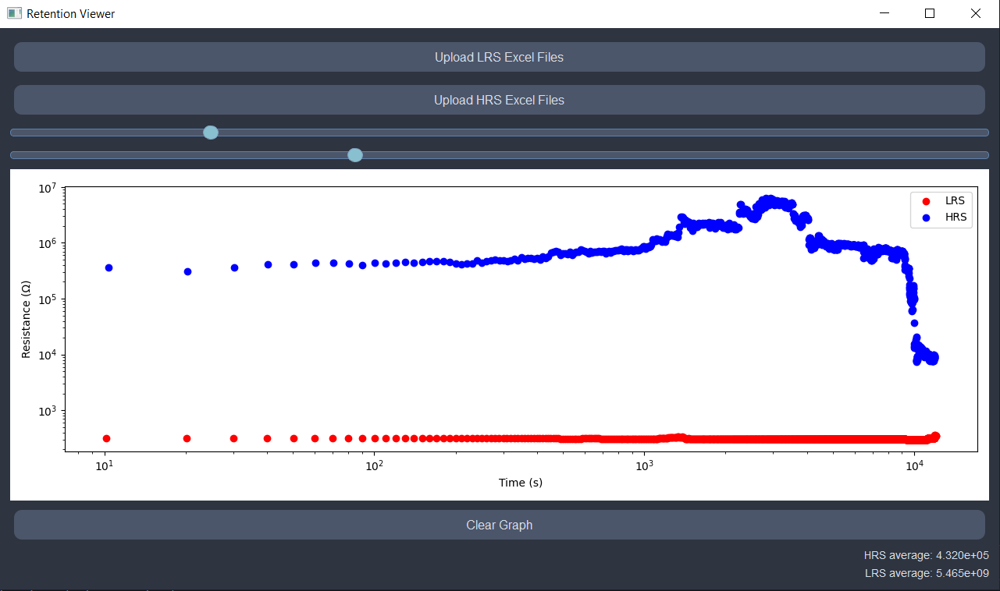
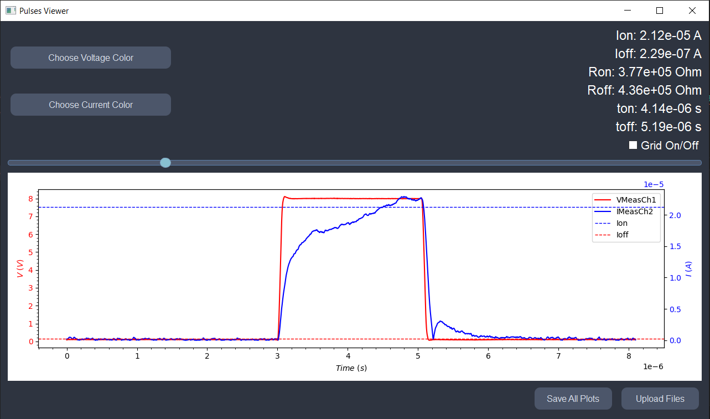
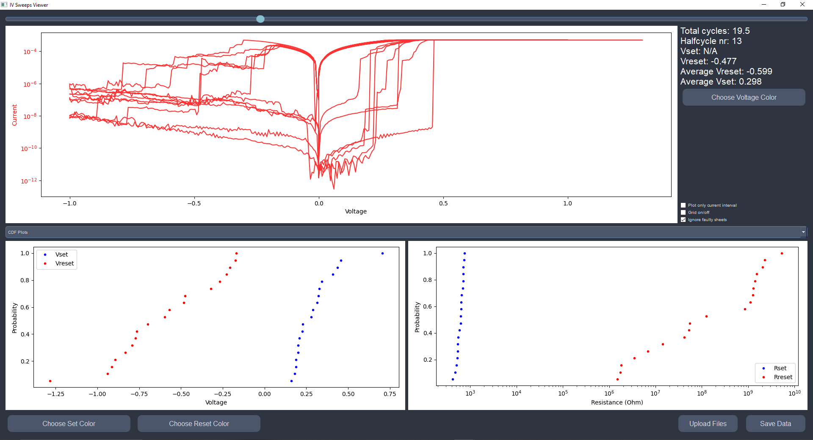
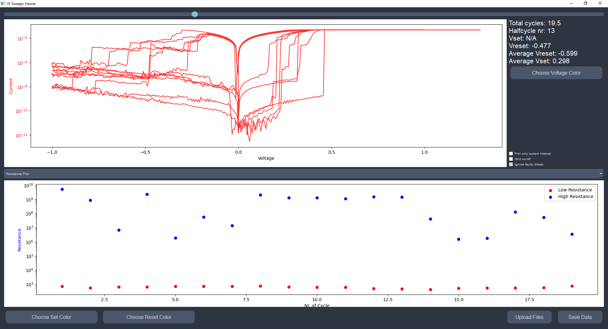

# 🧠 Memristor Metrics GUI

**Memristor Metrics GUI** is a Python-based desktop application for analyzing and visualizing electrical characteristics of memristors measured using the Clarius 4200A-SCS software and a Lakeshore cryogenic probe station. The GUI supports signal processing, feature extraction, and interactive plotting — no coding required.

---

## 🎯 Key Features

- 🧪 Analyze 4 types of memristor measurements:
  - **IV Sweeps**
  - **Pulse Analysis**
  - **Retention Behavior**
  - **Volatile Switching**
- ⚡ Automatic extraction of key parameters:
  - `Ion`, `Ioff`, `Ron`, `Roff`, `Vset`, `Vreset`
- 📈 Interactive plotting with:
  - Sliders, zoom, log scaling, scientific notation
  - Dynamic UI for selecting channels and colors
- 📁 Batch processing of Excel files (`.xls`, `.xlsx`)
- 💾 Export processed data and save plots
- 🖱 Right-click plots to export PNGs

---

## 🚀 Getting Started

### 🧪 Run from Source (Python)

#### 1. Install dependencies
```bash
pip install -r requirements.txt
```

#### 2. Launch the app
```bash
python main.py
```

> Python 3.7+ is recommended.

---


## 📂 Project Structure

| File/Folder          | Description                                  |
|----------------------|----------------------------------------------|
| `main.py`            | 🔹 Entry point for launching the GUI          |
| `class_IVSweeps.py`  | GUI module for IV sweep analysis             |
| `class_pulses.py`    | GUI module for pulse waveform analysis       |
| `class_Retention.py` | GUI module for resistance retention tracking |
| `class_volatile.py`  | GUI module for volatile switching behavior   |
| `screenshots/`       | App preview images for README                |
| `requirements.txt`   | List of Python dependencies                  |
| `README.md`          | You are here 📖                               |

---

## ⚙️ Dependencies

Install all at once using:

```bash
pip install -r requirements.txt
```

Or install manually:

- `PyQt5`
- `pandas`
- `numpy`
- `matplotlib`
- `scipy`
- `mplcursors`
- `openpyxl`
- `xlrd`

---

## 📷 Screenshots


### 🧭 Retention View  


### 🔋 Pulse Viewer  


### 📉 IV Sweep Analysis  




---

## 📄 License

This project is licensed under the **MIT License** — free to use, modify, and distribute with attribution.


---

## 👨‍🔬 Author

Developed by **Lek Ibrahimi**  
Originally created for experimental analysis of memristor measurements in an academic research setting.

---

## 🙋‍♂️ FAQ

**Q: Can I run this without any data?**  
You can launch and explore the interface, but the analysis features require actual Excel data from Clarius 4200A-SCS.

**Q: Can I cite or reuse this in my research?**  
Yes! Just keep the MIT License and feel free to adapt it to your needs.

---
